# Analyse des résultats

Dans ce document, nous allons analyser les résultats que nous avons obtenu à partir des différents programmes exécutés.

## Configuration de l'environnement

Pour référence, les programmes ont été exécutés sur un ordinateur portable MSI, avec la configuration suivante:

- Processeur: Intel Core i5 7th Gen (2.5 GHz)
- Mémoire RAM: 16 Go
- Système d'exploitation: Windows 10
- GPU: NVIDIA GeForce GTX 1050 Ti (4 Go)

Screenshot configuration GPU

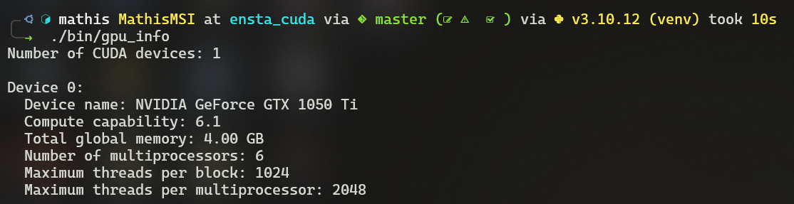

## Conditions d'exécution

Les programmes ont été exécutés sur la machine et ont été lancés grâce aux scripts bash définis dans le répertoire `scripts/`.
Les logs ont été enregistrés dans le répertoire `output_cuda/`, qui est ignoré par git pour ne pas surcharger le dépôt.

Screenshot exécution finale

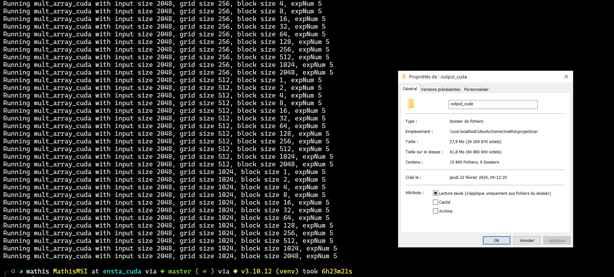

## Résultats

### Exécution du programme `seq_array`

Le programme `seq_array` a pour objectif de calculer la somme des éléments d'un tableau de taille `N` et de comparer l'exécution séquentielle avec l'exécution parallèle.

#### Résultat pour [seq_array](../src/seq_array.c)

Résultats du programme C

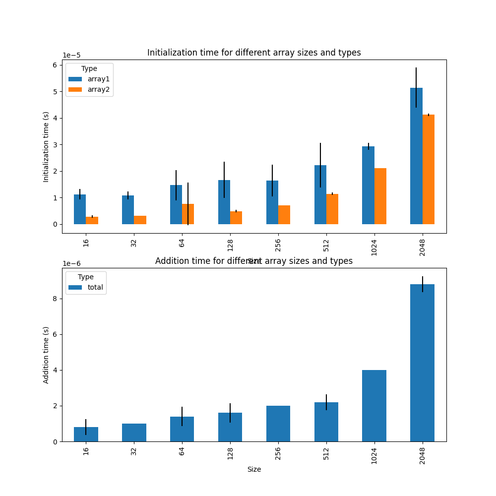

#### Résultat pour [seq_array_cuda](../src/seq_array_cuda.cu)

Résultats du programme CUDA - Full Comparaison

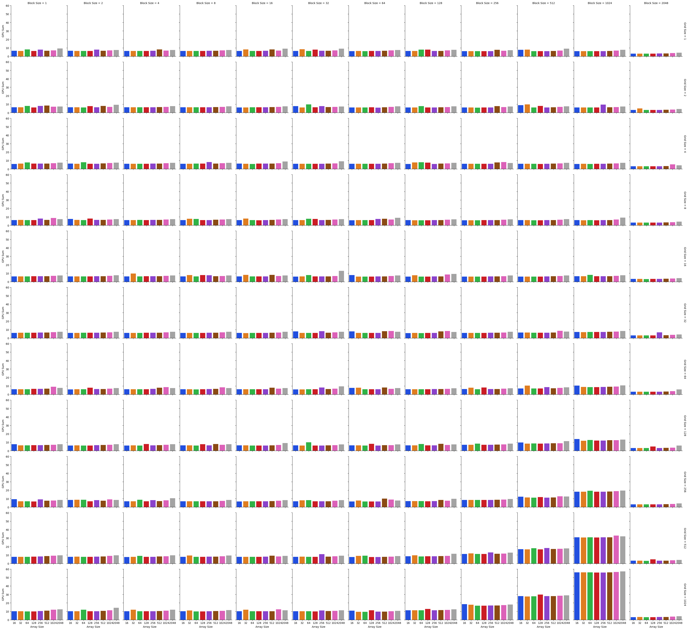

Résultats du programme CUDA - Categorized bar plot

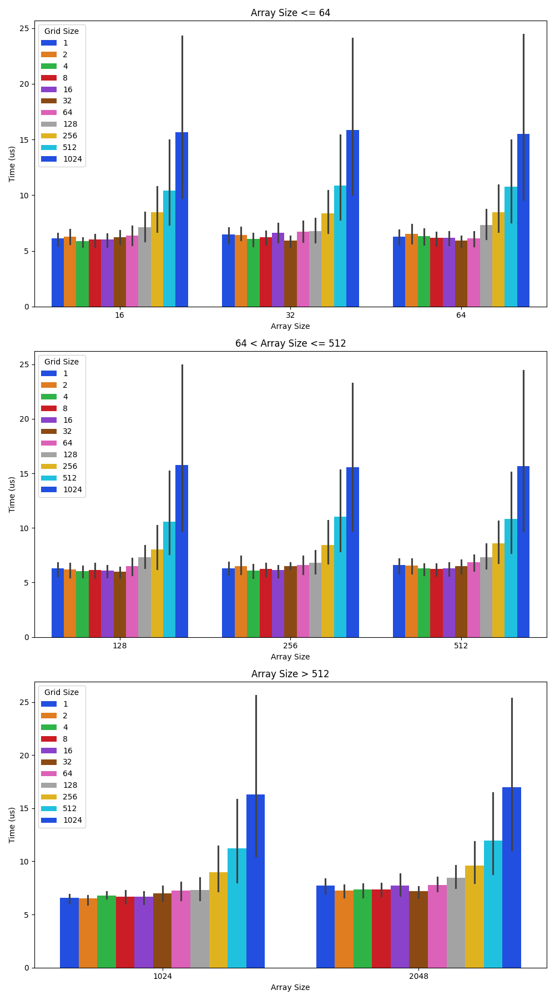

Résultats du programme CUDA - 3D bar plot

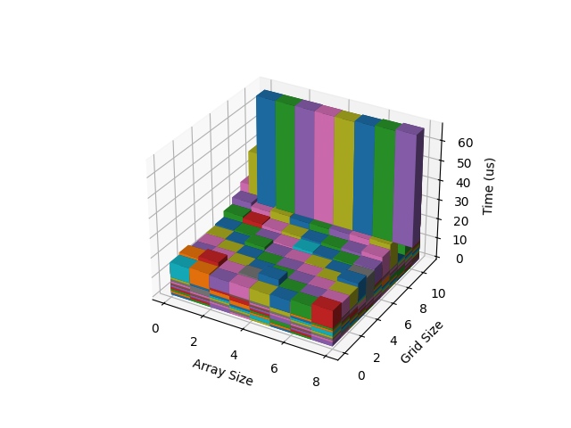

#### Analyse de `seq_array`

On constate que l'exécution du programme avec le CPU est plus **lent** que celle sur GPU.
En effet, le temps maximal d'exécution du programme sur le CPU est de 58 $\mu s$, alors qu'il est de 15 $\mu s$ sur le GPU.

### Exécution du programme `add_matrix`

Le programme `add_matrix` a pour objectif de calculer la somme de deux matrices de taille `N x N` et de comparer l'exécution séquentielle avec l'exécution parallèle.

#### Résultat pour [add_matrix](../src/add_matrix.c)

Résultats du programme C

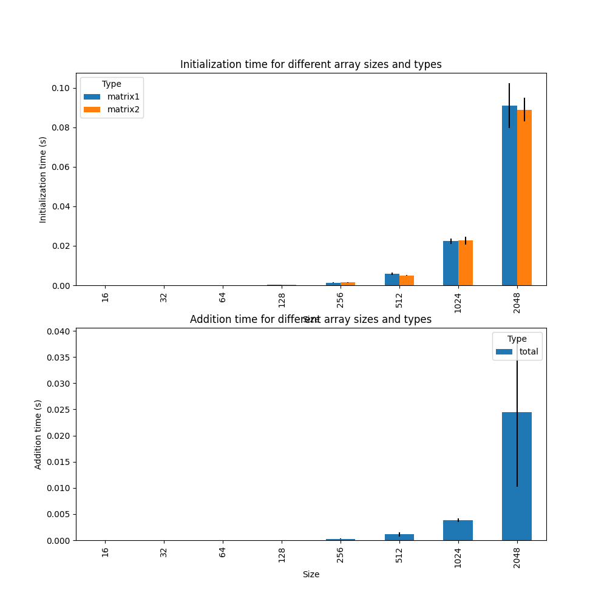

#### Résultat pour [add_matrix_cuda](../src/add_matrix_cuda.cu)

Résultats du programme CUDA - Full Comparaison

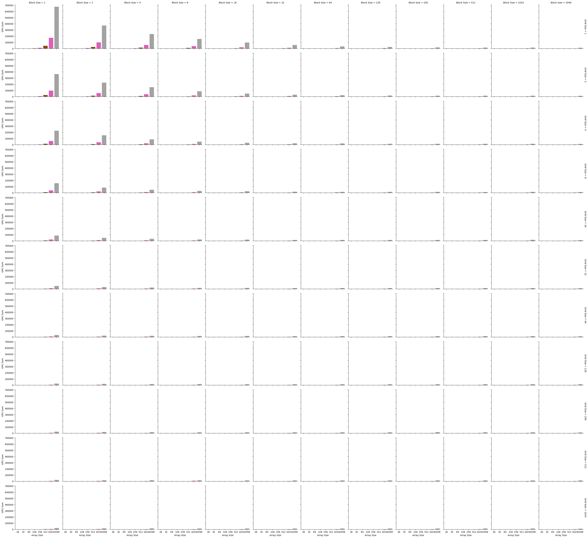

Résultats du programme CUDA - Categorized bar plot

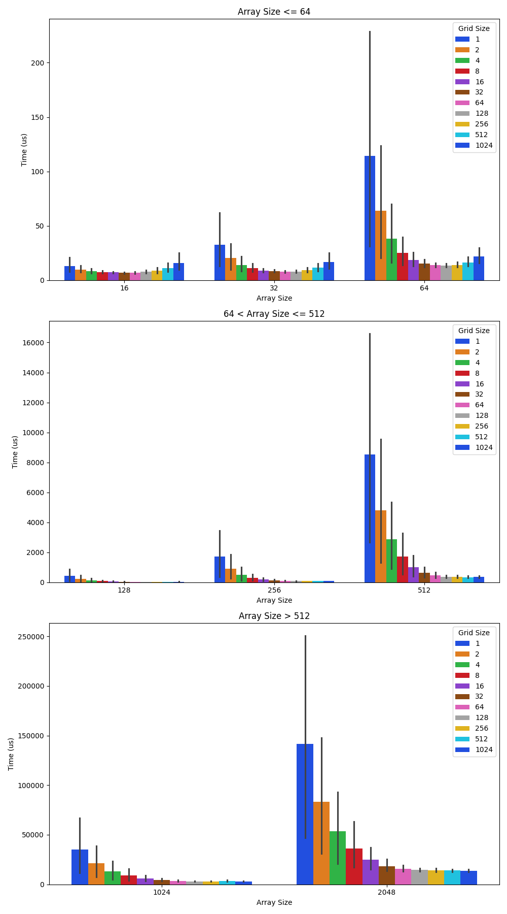

Résultats du programme CUDA - 3D bar plot

#### Analyse pour `add_matrix`

Pour la performance de `add_matrix`, on constate que l'exécution du programme avec le CPU et le GPU sont assez proches.
En effet, les temps d'exécution sur le CPU sont compris entre 0 (négligeable) et $(80+25) = 105 ms$ environ, alors que sur le GPU, ils sont compris entre 0 (négligeable) et $150 \ 000 \ \mu s = 150 ms$.
De plus, on remarque, pour le GPU, que les temps varient fortement en fonction du nombre de threads ou blocs utilisés. (cf. graphiques pour plus de détails). Logiquement, plus le nombre de threads ou blocs est élevé, plus le temps d'exécution est faible.

### Exécution du programme `mult_array`

Le programme `mult_array` a pour objectif de calculer la somme des éléments d'un tableau de taille `N` en utilisant un algorithme séquentiel.

#### Résultat pour [mult_array](../src/mult_array.c)

Résultats du programme C

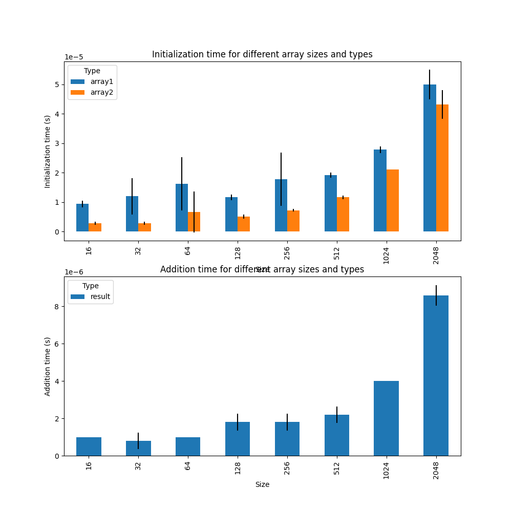

#### Résultat pour [mult_array_cuda](../src/mult_array_cuda.cu)

Résultats du programme CUDA - Full Comparaison

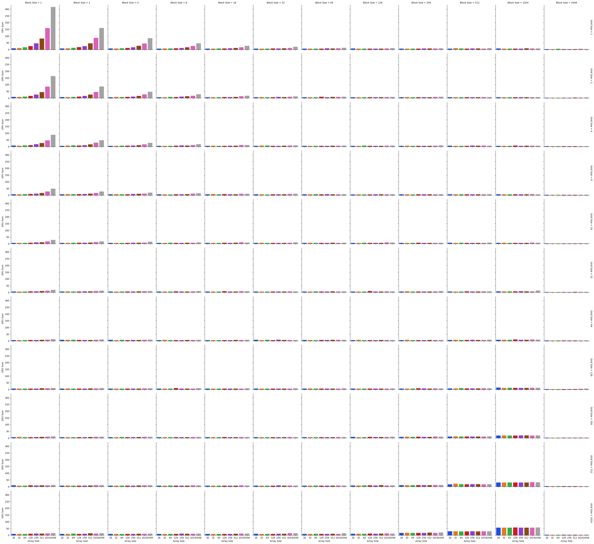

Résultats du programme CUDA - Categorized bar plot

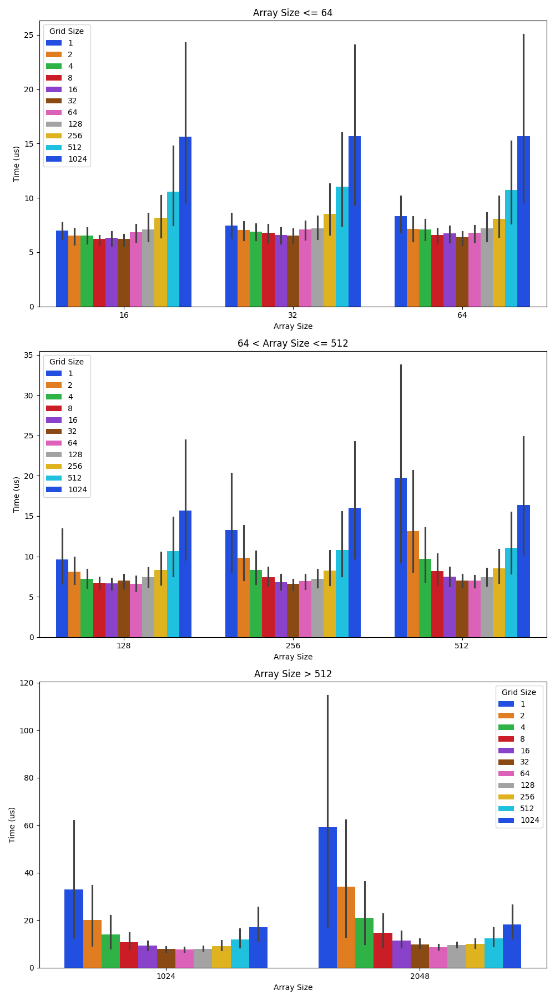

Résultats du programme CUDA - 3D bar plot

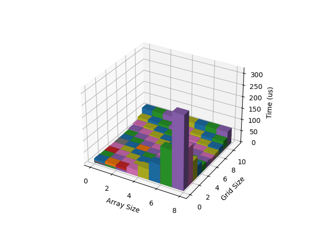

#### Analyse pour `mult_array`

L'exécution du programme avec le CPU est moins rapide que celle sur GPU.

En effet, on constate que l'exécution prend environ 50 $\mu s$ sur le CPU, alors qu'elle prend environ 15-20 $\mu s$ sur le GPU.

Toutefois, on remarque également des différences en fonction du nombre de threads ou blocs utilisés. (cf. graphiques pour plus de détails)

## Conclusion

On peut tirer deux conclusions principales de ces résultats:

1. Les programmes exécutés sur le GPU sont plus rapides que ceux exécutés sur le CPU. Cela est dû au fait que le GPU est conçu pour effectuer des calculs en parallèle, ce qui est plus rapide que le CPU.
2. Les performances des programmes exécutés sur le GPU varient en fonction du nombre de threads ou blocs utilisés. En effet, plus le nombre de threads ou blocs est élevé, plus le temps d'exécution est faible.

Enfin, les conditions d'expérimentation sont à prendre en compte pour une analyse plus précise des résultats. Les performances peuvent varier en fonction de la machine, du système d'exploitation, de la mémoire disponible, etc. Aussi, l'accès à la mémoire partagée est un facteur important à prendre en compte pour des calculs plus complexes.
